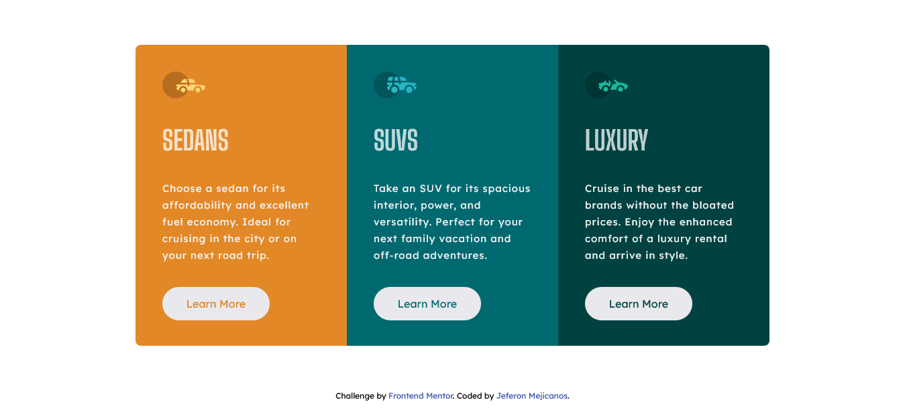

# Frontend Mentor - 3-column preview card component solution

This is a solution to the [3-column preview card component challenge on Frontend Mentor](https://www.frontendmentor.io/challenges/3column-preview-card-component-pH92eAR2-). Frontend Mentor challenges help you improve your coding skills by building realistic projects. 

## Table of contents

- [Overview](#overview)
  - [Screenshot](#screenshot)
  - [Links](#links)
- [My process](#my-process)
  - [Built with](#built-with)
  - [What I learned](#what-i-learned)
  - [Continued development](#continued-development)
  - [Useful resources](#useful-resources)
- [Author](#author)

## Overview

### Screenshot



### Links

- Solution URL: [Add solution URL here](https://github.com/Jeferson57/3-column-preview-card-component.github.io)
- Live Site URL: [Add live site URL here](https://jeferson57.github.io/3-column-preview-card-component.github.io/)

## My process

### Built with

- Semantic HTML5 markup
- CSS custom properties
- CSS Grid
- Mobile-first workflow


### What I learned


```html
I learn about the target attribute:
  <a href="/" target="_blank">Jeferon Mejicanos</a>
```
```css
I learn how to use the function minmax() of CSS Grid
  .grid-container {
    grid-template-columns: minmax(310px, 355px);
  }
And I understood much better how grid-auto-flow 
  .grid-container {
    grid-auto-flow: row | column | row dense | column dense;
  }
```

### Continued development

I think I'll first practice more on responsive design and mobile first. And I will practice more CSS Grid.

### Useful resources

- [Example resource 1](https://css-tricks.com/) - This helped me because there are many guides abour CSS. I really liked this pattern and will use it going forward.

## Author

- GitHub - [Jeferson Mejicanos](https://github.com/Jeferson57)
- Frontend Mentor - [@Jeferson57](https://www.frontendmentor.io/profile/Jeferson57)
- Twitter - [@Jeferso06531446](https://twitter.com/Jeferso06531446)